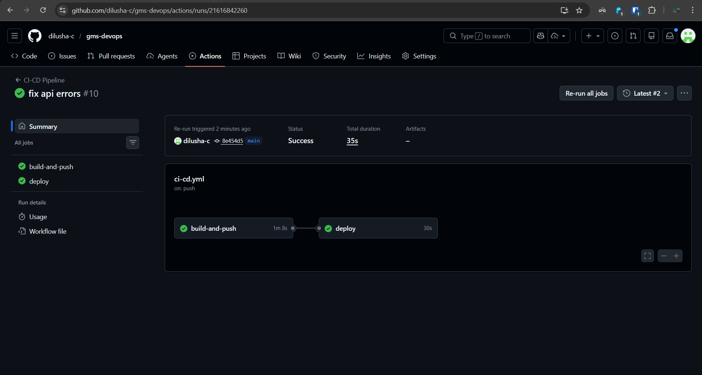
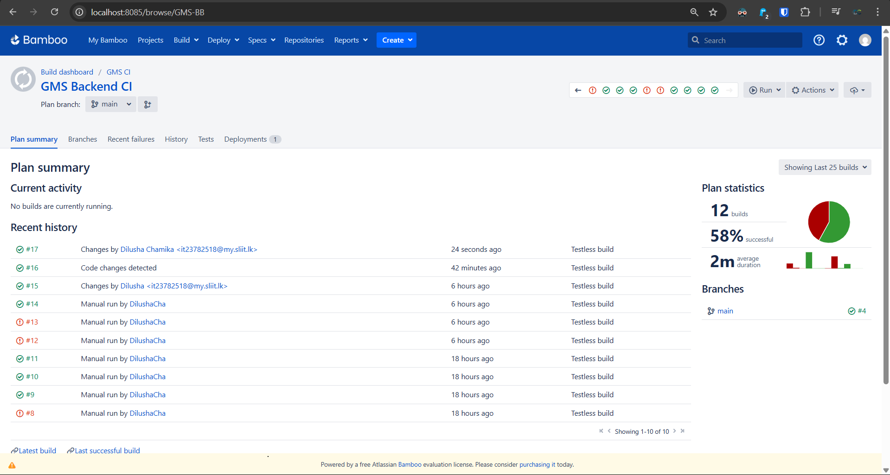
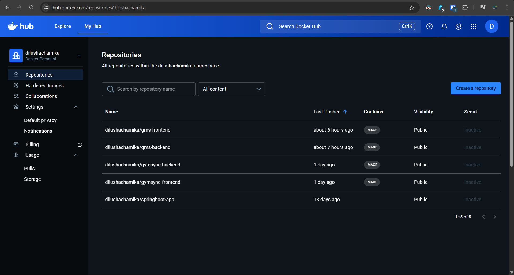
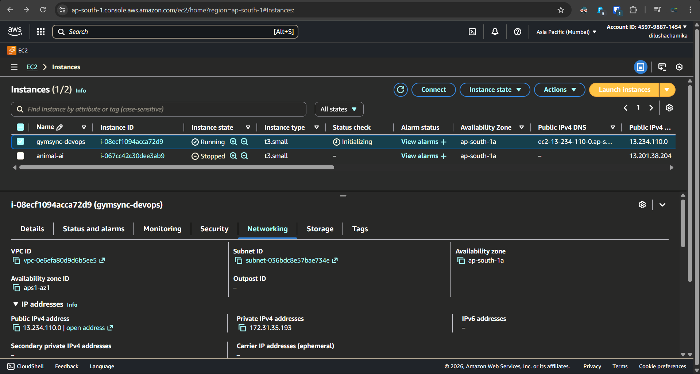
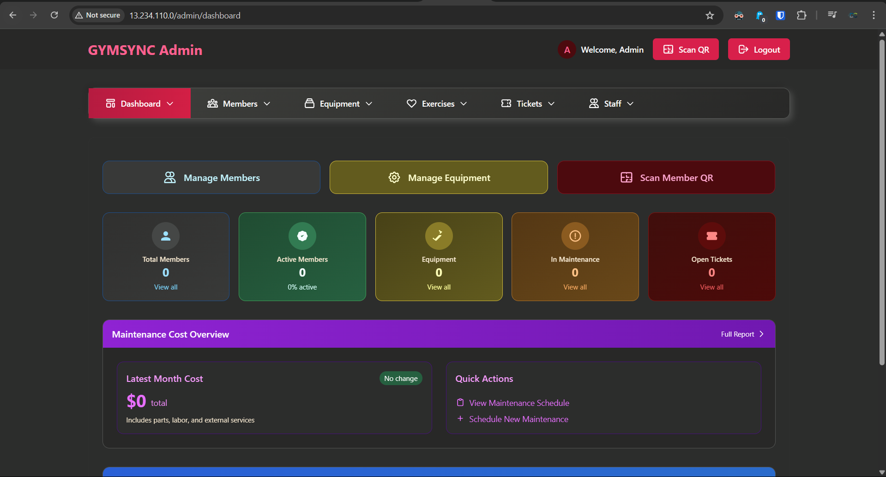

# GymSync


_CI/CD Enabled Full-Stack Deployment on AWS_

## Overview

GymSync DevOps is a production-ready DevOps implementation for a full-stack Gym Management System.
The project demonstrates end-to-end CI/CD, Dockerized deployment, and cloud hosting on AWS EC2 using real-world DevOps practices.

Every push to the main branch automatically builds, containerizes, and deploys the application to a live EC2 instance.

## 🚀 Architecture Overview

- Frontend: React (Vite) served via Nginx container
- Backend: Spring Boot REST API
- Database: MySQL
- CI/CD: GitHub Actions + Atlassian Bamboo
- Containerization: Docker & Docker Compose
- Cloud: AWS EC2 (Ubuntu)

## 🔄 CI/CD Workflow

1. Code pushed to GitHub main branch
2. GitHub Actions builds backend JAR and frontend assets
3. Docker images are built for backend and frontend
4. Images are pushed to Docker Hub
5. GitHub Actions connects to AWS EC2 via SSH
6. Docker Compose pulls latest images and redeploys containers

### 🟦 Bamboo Dev Pipeline

In addition to GitHub Actions, an Atlassian Bamboo plan mirrors the deployment for the dev environment:

1. **Trigger**: Bamboo plan listens on the `dev` branch.
2. **Build**: Runs Maven and Vite builds inside agents, producing artifacts and Docker images.
3. **Registry Push**: Tags and pushes `gymsync-backend` and `gymsync-frontend` images to Docker Hub.
4. **Deploy**: Uses Bamboo SSH tasks to log into the dev EC2 host, pull the latest images, and execute `docker compose up -d --force-recreate`.
5. **Verification**: Final stage hits the health endpoints (Nginx `/` and backend `/actuator/health`) to confirm a successful rollout.

## 🖼️ Project Screenshots

1️⃣ GitHub Actions CI/CD Pipeline  
Automated CI/CD pipeline showing successful build and deployment.



2️⃣ Bamboo Dev Pipeline Dashboard  
Atlassian Bamboo plan stages covering build, push, deploy, and verification for the dev environment.



3️⃣ Docker Hub Repositories  
Docker Hub repositories storing backend and frontend images.



4️⃣ AWS EC2 Instance  
AWS EC2 instance hosting the GymSync application.



5️⃣ Docker Containers Running on EC2  
SSH terminal showing live Docker containers using Docker Compose.


6️⃣ Live GymSync Web Application  
Production GymSync admin dashboard running on AWS.



## 🐳 Docker Compose Configuration

```yaml
services:
  mysql:
    image: mysql:8
    container_name: gymsync-mysql
    environment:
      MYSQL_ROOT_PASSWORD: password
      MYSQL_DATABASE: gms1
    volumes:
      - mysql_data:/var/lib/mysql

  backend:
    image: dilushachamika/gymsync-backend
    container_name: gymsync-backend
    depends_on:
      - mysql
    environment:
      SPRING_DATASOURCE_URL: jdbc:mysql://mysql:3306/gms1
      SPRING_DATASOURCE_USERNAME: root
      SPRING_DATASOURCE_PASSWORD: password
    ports:
      - "8090:8090"

  frontend:
    image: dilushachamika/gymsync-frontend
    container_name: gymsync-frontend
    depends_on:
      - backend
    ports:
      - "80:80"

volumes:
  mysql_data:

```

## 🧰 Technologies Used

- GitHub Actions
- Docker
- AWS EC2
- CI/CD Automation (GitHub Actions + Bamboo)

## 📌 DevOps Highlights

- Fully automated CI/CD pipeline (prod via GitHub Actions, dev via Bamboo)
- Zero manual deployment
- Multi-container orchestration
- Cloud-based production deployment
- Real-world DevOps workflow

## 👤 Author

Dilusha Chamika  
Computer Systems Engineering Undergraduate  
DevOps | Cloud | Automation

## 📄 License

MIT License